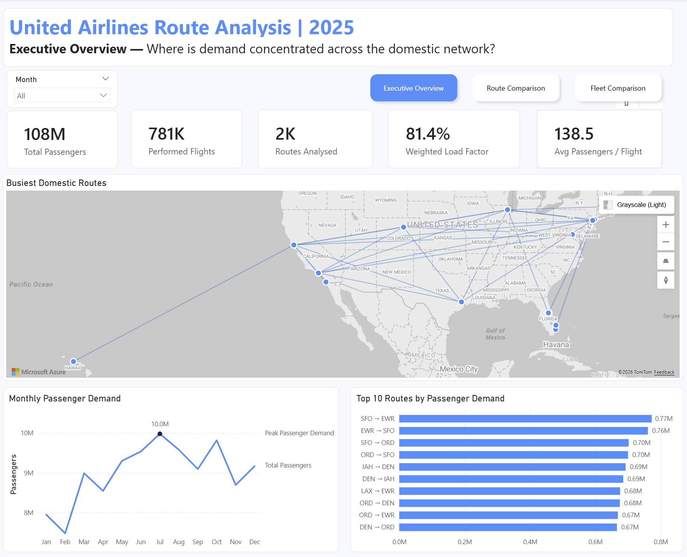
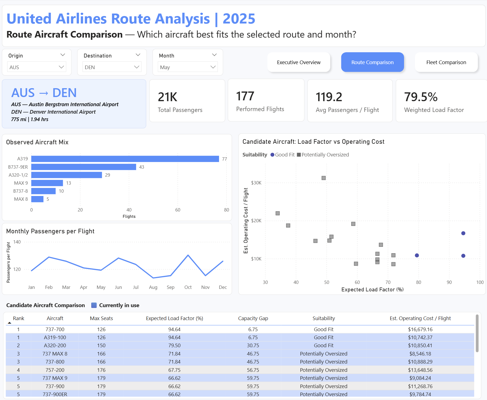
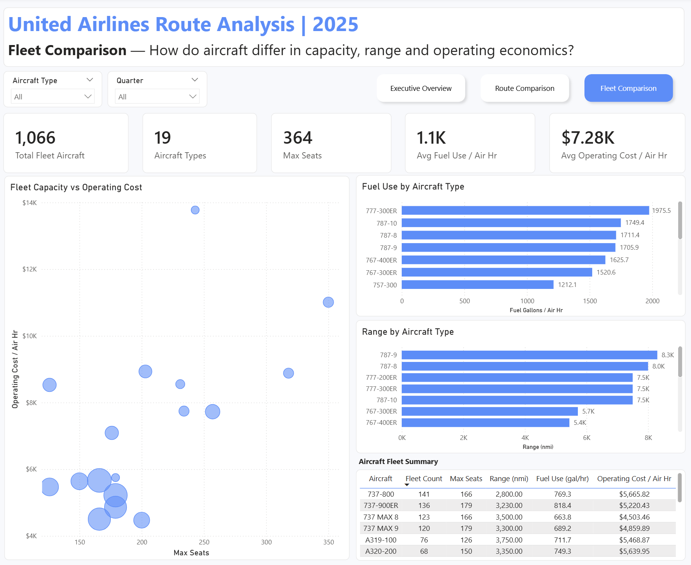

# Airline Fleet Deployment Analysis

### United Airlines 2025 U.S. Domestic Network  
**SQL Server · Medallion Architecture · Power BI · Data Modelling**

An end-to-end data engineering and business intelligence project analysing aircraft suitability across United Airlines' 2025 U.S. domestic network.

The project combines passenger demand, aircraft capacity, route distance, fleet information, aircraft range and publicly available operating-economics data to compare which aircraft within United's existing fleet appear operationally suitable for individual routes and months.

The solution follows a Medallion Architecture:

```text
Raw Source Data
      ↓
    Bronze
      ↓
    Silver
      ↓
     Gold
      ↓
   Power BI
```

The project was built both as a portfolio project and as a practical exercise in SQL, data modelling, data quality, analytical thinking and business intelligence.

> **Important:** This is a decision-support analysis, not a real-world aircraft scheduling or fleet optimisation engine.

---

## Interactive Power BI Report

Explore the completed interactive dashboard:

### 👉 [Open the Interactive Power BI Report](https://app.powerbi.com/view?r=eyJrIjoiYWE5ZjFiMjUtODIwMi00NDQyLWE4OWEtZWYwMDliNTM5N2VmIiwidCI6ImNlZjk5OTUzLWM0OTYtNGE4MS1iMDYxLTNlYmU1ODRjY2ZjYyIsImMiOjh9&pageName=4a862aa3c48ce0d5dca8)

The report allows users to explore:

- Network-wide passenger demand
- Monthly seasonality
- Busiest domestic routes
- Aircraft currently operated on selected routes
- Alternative aircraft based on capacity and range
- Expected candidate load factor
- Capacity gaps
- Aircraft fuel-use differences
- Operating-cost trade-offs
- Fleet-wide capacity and range differences

---

## Dashboard Preview

Click any screenshot to open the interactive Power BI report.

### Executive Overview

[](https://app.powerbi.com/view?r=eyJrIjoiYWE5ZjFiMjUtODIwMi00NDQyLWE4OWEtZWYwMDliNTM5N2VmIiwidCI6ImNlZjk5OTUzLWM0OTYtNGE4MS1iMDYxLTNlYmU1ODRjY2ZjYyIsImMiOjh9&pageName=4a862aa3c48ce0d5dca8)

### Route Aircraft Comparison

[](https://app.powerbi.com/view?r=eyJrIjoiYWE5ZjFiMjUtODIwMi00NDQyLWE4OWEtZWYwMDliNTM5N2VmIiwidCI6ImNlZjk5OTUzLWM0OTYtNGE4MS1iMDYxLTNlYmU1ODRjY2ZjYyIsImMiOjh9&pageName=4a862aa3c48ce0d5dca8)

### Fleet Comparison

[](https://app.powerbi.com/view?r=eyJrIjoiYWE5ZjFiMjUtODIwMi00NDQyLWE4OWEtZWYwMDliNTM5N2VmIiwidCI6ImNlZjk5OTUzLWM0OTYtNGE4MS1iMDYxLTNlYmU1ODRjY2ZjYyIsImMiOjh9&pageName=4a862aa3c48ce0d5dca8)

---

# Business Question

> **For each United Airlines U.S. domestic route and month, which aircraft in the existing fleet appear operationally suitable based on demand, capacity and range, and what fuel and operating-cost trade-offs exist between the viable alternatives?**

Supporting questions include:

- Where is passenger demand concentrated?
- How does demand change throughout the year?
- How many passengers are carried on an average flight?
- Which aircraft are currently being used?
- Which other aircraft could potentially serve the route?
- Would a candidate aircraft be too small, capacity tight, a good fit or potentially oversized?
- Does the aircraft have sufficient reference range?
- How do viable aircraft differ economically?
- Is the closest capacity fit also the lowest-cost alternative?

---

# Project Scope

| Area | Scope |
|---|---|
| Airline | United Airlines |
| Period | 2025 |
| Geography | U.S. domestic nonstop routes |
| Route Grain | Directional |
| Demand Frequency | Monthly |
| Economics Frequency | Quarterly |
| Fleet | United mainline fleet |
| Database | SQL Server |
| Architecture | Bronze / Silver / Gold |
| Reporting | Power BI |

Routes are directional.

For example:

```text
EWR → SFO
```

and:

```text
SFO → EWR
```

are analysed separately.

---

# Technology Stack

- SQL Server
- SQL Server Management Studio
- T-SQL
- Power BI Desktop
- Power Query
- DAX
- Git
- GitHub

---

# Data Sources

Six source datasets are used.

| Dataset | Purpose |
|---|---|
| BTS T-100 Segment | Passenger demand, seats, departures, aircraft type, distance and airborne time |
| BTS Aircraft Types | Aircraft-type reference data |
| BTS Form 41 Schedule P-5.2 | Quarterly fuel, maintenance and operating economics |
| OurAirports | Airport names, countries and geographic coordinates |
| United Fleet Reference | Mainline fleet counts and seating configurations |
| Aircraft Range Reference | Manufacturer/public reference range |

Further source information is available here:

### [View the Raw Data Guide](data/raw/README.md)

A detailed description of the warehouse tables, views and their grains is available here:

### [View the Data Dictionary](docs/data_dictionary.md)

---

# Repository Structure

```text
airline-fleet-deployment-optimisation-project/
│
├── README.md
├── .gitignore
│
├── data/
│   └── raw/
│       └── README.md
│
├── docs/
│   ├── data_dictionary.md
│   └── images/
│       ├── executive-overview.png
│       ├── route-comparison.png
│       └── fleet-comparison.png
│
└── scripts/
    ├── 01_init_database.sql
    │
    ├── bronze/
    │   ├── 02_ddl_bronze.sql
    │   ├── 03_proc_load_bronze.sql
    │   ├── 04_bronze_quality_checks.sql
    │   └── README.md
    │
    ├── silver/
    │   ├── 05_ddl_silver.sql
    │   ├── 06_proc_load_silver.sql
    │   ├── 07_silver_quality_checks.sql
    │   └── README.md
    │
    └── gold/
        ├── 08_gold_model.sql
        ├── 09_gold_quality_checks.sql
        ├── 10_route_suitability_analysis.sql
        └── README.md
```

---

# Data Architecture

## Bronze Layer

The Bronze layer preserves the raw source data as closely as practical.

Six source-aligned tables are created:

```text
bronze.t100_segment_raw
bronze.aircraft_types_raw
bronze.united_fleet_raw
bronze.airports_raw
bronze.aircraft_range_raw
bronze.aircraft_operating_cost_raw
```

Responsibilities include:

- Raw CSV ingestion
- Source preservation
- Initial profiling
- Source-level quality checks
- Investigation of data grain
- Identification of source inconsistencies

Data is loaded using SQL Server `BULK INSERT`.

### [View Bronze Layer Documentation](scripts/bronze/README.md)

---

## Silver Layer

The Silver layer cleans, standardises and restructures the source data.

Seven reusable tables are created:

```text
silver.united_fleet
silver.aircraft_types
silver.airports
silver.aircraft_range
silver.aircraft_mapping
silver.route_aircraft_monthly
silver.aircraft_operating_cost
```

Key transformations include:

- Cleaning text fields
- Safe data-type conversion
- Standardising aircraft information
- Reconciling aircraft identifiers
- Filtering United Airlines 2025 operational data
- Aggregating route activity to monthly grain
- Preparing airport geographic information
- Preparing aircraft range information
- Preparing quarterly operating economics

### [View Silver Layer Documentation](scripts/silver/README.md)

---

## Gold Layer

Gold applies the analytical and business logic.

Five views are created:

```text
gold.route_monthly_summary
gold.route_aircraft_candidates
gold.route_aircraft_suitability
gold.route_aircraft_ranked
gold.route_aircraft_best_fit
```

The analytical flow is:

```text
Monthly Route Demand
        ↓
Compare Against Every Fleet Aircraft
        ↓
Range Feasibility
        ↓
Capacity Comparison
        ↓
Suitability Classification
        ↓
Candidate Ranking
        ↓
Fuel / Cost Comparison
        ↓
Power BI
```

### [View Gold Layer Documentation](scripts/gold/README.md)

---

# Important Data Modelling Decision — Grain

One of the main lessons from the project was understanding what one row represents before performing aggregation.

The final Silver operational grain is:

```text
YEAR
+ MONTH
+ ORIGIN
+ DESTINATION
+ AIRCRAFT TYPE
```

For example:

```text
January 2025
EWR → SFO
Aircraft Type 627
```

Raw T-100 data can contain multiple rows below this analytical grain.

Measures such as:

```text
Passengers
Seats
Departures
Air Time
```

are additive and therefore use `SUM()`.

Route distance is not additive and is not summed across repeated operational rows.

The Gold layer then removes aircraft type to create total monthly route demand:

```text
YEAR
+ MONTH
+ ORIGIN
+ DESTINATION
```

This allows every candidate aircraft to be compared against the same total route demand.

---

# Core Analytical Metrics

## Passengers per Flight

```text
Total Passengers
÷
Performed Flights
```

Represents average observed passenger demand per operated flight.

---

## Observed Load Factor

```text
Total Passengers
÷
Total Seats
```

Measures how much of the historically supplied seating capacity was occupied.

---

## Expected Candidate Load Factor

```text
Passengers per Flight
÷
Candidate Aircraft Seats
```

Estimates how full a candidate aircraft would appear if the same average observed demand were applied to it.

This is a comparison metric rather than a demand forecast.

---

## Capacity Gap

```text
Candidate Aircraft Seats
-
Passengers per Flight
```

Measures how much seating capacity remains relative to average passenger demand.

---

# Candidate Aircraft Generation

Every route-month is compared against every aircraft type in United's mainline fleet.

Conceptually:

```text
ROUTE MONTHS
      ×
UNITED FLEET
```

This is implemented using a SQL:

```sql
CROSS JOIN
```

This allows the analysis to ask:

> If every aircraft in the existing fleet were considered for this route and month, how would its capacity and range compare with observed demand?

---

# Suitability Categories

Candidates are assigned one of five categories:

```text
Not Suitable for Route Distance
Too Small
Capacity Tight
Good Fit
Potentially Oversized
```

The project rules are:

| Condition | Classification |
|---|---|
| Aircraft fails reference range check | Not Suitable for Route Distance |
| Expected load factor > 100% | Too Small |
| Expected load factor > 95% | Capacity Tight |
| Expected load factor >= 75% | Good Fit |
| Expected load factor < 75% | Potentially Oversized |

These thresholds are project assumptions.

They are **not** official United Airlines or aviation-industry fleet-planning rules.

---

# Candidate Ranking

Only viable candidates are ranked.

The following categories are excluded:

```text
Too Small
Not Suitable for Route Distance
```

Remaining aircraft are prioritised:

```text
1. Good Fit
2. Capacity Tight
3. Potentially Oversized
```

Within each category, smaller capacity gaps are preferred.

Ranking uses:

```sql
DENSE_RANK()
```

This allows legitimate ties to remain rather than forcing an artificial winner.

---

# Aircraft Economics

BTS Form 41 Schedule P-5.2 provides quarterly aircraft-type operating information.

Metrics derived include:

```text
Fuel Gallons per Air Hour
Fuel Cost per Air Hour
Operating Cost per Air Hour
Maintenance Cost per Air Hour
```

Monthly route data is matched to the corresponding quarter:

```text
Jan-Mar → Q1
Apr-Jun → Q2
Jul-Sep → Q3
Oct-Dec → Q4
```

Estimated route-flight comparison measures are then calculated.

For example:

```text
Estimated Operating Cost per Flight
=
Observed Average Route Air Time
×
Candidate Operating Cost per Air Hour
```

and:

```text
Estimated Fuel per Flight
=
Observed Average Route Air Time
×
Candidate Fuel Gallons per Air Hour
```

These are comparison proxies.

They are **not**:

- Exact route accounting costs
- Exact fuel-planning calculations
- Route profitability calculations
- Expected financial savings

---

# 777-200 Family Limitation

BTS aircraft code:

```text
627
```

represents the wider Boeing 777-200 family.

United's fleet reference separately identifies:

```text
777-200
777-200ER
```

The public BTS source does not contain enough information to confidently allocate family-level economics to one exact subtype.

The project therefore deliberately leaves exact operating economics unavailable for these variants rather than forcing an unreliable mapping.

---

# Power BI Report

The report follows a three-stage analytical story:

```text
NETWORK DEMAND
      ↓
ROUTE SUITABILITY
      ↓
FLEET TRADE-OFFS
```

---

## Page 1 — Executive Overview

### Question

> **Where is demand concentrated across the domestic network?**

The page provides a high-level view of the 2025 domestic network.

### KPIs

- Total Passengers
- Performed Flights
- Routes Analysed
- Weighted Load Factor
- Average Passengers per Flight

### Visuals

- Busiest Domestic Routes map
- Monthly Passenger Demand
- Top 10 Routes by Passenger Demand

The purpose is to establish:

```text
How large is the network?
Where is demand concentrated?
How does demand change throughout the year?
Which routes carry the most passengers?
```

---

## Page 2 — Route Aircraft Comparison

### Question

> **Which aircraft best fits the selected route and month?**

Users select:

- Origin
- Destination
- Month

The page then displays:

### Route Profile

- Route
- Origin and destination airports
- Route distance
- Average airborne time

### Route KPIs

- Total Passengers
- Performed Flights
- Average Passengers per Flight
- Weighted Load Factor

### Observed Aircraft Mix

Shows aircraft that were actually used on the route.

### Monthly Passengers per Flight

Provides seasonal demand context.

### Candidate Aircraft Analysis

Viable candidate aircraft are compared using:

- Candidate rank
- Maximum seats
- Expected load factor
- Capacity gap
- Suitability
- Estimated operating-cost proxy

Aircraft actually used on the selected route/month are highlighted within the candidate table.

This allows the user to compare:

```text
What was actually used?
```

against:

```text
What other aircraft appear operationally suitable?
```

---

## Page 3 — Fleet Comparison

### Question

> **How do aircraft differ in capacity, range and operating economics?**

The final page compares the aircraft themselves.

### KPIs

- Total Fleet Aircraft
- Aircraft Types
- Maximum Seats
- Average Fuel Use per Air Hour
- Average Operating Cost per Air Hour

### Fleet Capacity vs Operating Cost

Compares:

```text
Maximum Seats
vs
Operating Cost per Air Hour
```

Bubble size represents fleet count.

Interactive tooltips provide:

- Aircraft type
- Fleet count
- Maximum seats
- Fuel use
- Operating cost
- Reference range

### Fuel Use by Aircraft Type

Compares aircraft fuel intensity.

### Range by Aircraft Type

Compares manufacturer/public reference range.

### Aircraft Fleet Summary

Provides exact values for:

- Aircraft
- Fleet count
- Maximum seats
- Range
- Fuel use
- Operating cost

---

# Reproducing the Project

## Requirements

You will need:

- SQL Server
- SQL Server Management Studio
- Power BI Desktop
- Source CSV files documented in the [Raw Data Guide](data/raw/README.md)

---

## 1. Clone the Repository

```bash
git clone https://github.com/zainulNatha/airline-fleet-deployment-optimisation-project.git
```

---

## 2. Prepare the Source Data

Place the required CSV files inside:

```text
data/raw/
```

See:

### [Raw Data Guide](data/raw/README.md)

The `BULK INSERT` file paths may need to be updated for your own machine.

---

## 3. Initialise the Database

Run:

### [01_init_database.sql](scripts/01_init_database.sql)

This creates:

```text
AirlineRouteAnalysis
```

and the:

```text
bronze
silver
gold
```

schemas.

---

## 4. Build Bronze

Run in order:

1. [02_ddl_bronze.sql](scripts/bronze/02_ddl_bronze.sql)
2. [03_proc_load_bronze.sql](scripts/bronze/03_proc_load_bronze.sql)
3. [04_bronze_quality_checks.sql](scripts/bronze/04_bronze_quality_checks.sql)

---

## 5. Build Silver

Run:

1. [05_ddl_silver.sql](scripts/silver/05_ddl_silver.sql)
2. [06_proc_load_silver.sql](scripts/silver/06_proc_load_silver.sql)
3. [07_silver_quality_checks.sql](scripts/silver/07_silver_quality_checks.sql)

---

## 6. Build Gold

Run:

1. [08_gold_model.sql](scripts/gold/08_gold_model.sql)
2. [09_gold_quality_checks.sql](scripts/gold/09_gold_quality_checks.sql)
3. [10_route_suitability_analysis.sql](scripts/gold/10_route_suitability_analysis.sql)

---

## 7. Connect Power BI

Connect Power BI to:

```text
Database: AirlineRouteAnalysis
```

using SQL Server Import mode.

If using the supplied Power BI file, update the data-source connection to your own SQL Server instance and refresh the model.

---

# Using This Project to Practise SQL

This repository can also be used as a practical SQL and data-engineering learning project.

It is best suited to someone who understands basic SQL and wants to progress from isolated queries into a larger end-to-end project.

Rather than only running the finished scripts, learners can:

1. Read the business requirement.
2. Inspect the raw data.
3. Determine the required grain.
4. Attempt each transformation themselves.
5. Compare their solution with the supplied SQL.
6. Run the quality checks.
7. Explain why each transformation is required.

---

## SQL Concepts Practised

### SQL Foundations

- `SELECT`
- `WHERE`
- `GROUP BY`
- `ORDER BY`
- Aggregate functions

### Data Cleaning

- `TRIM`
- `NULLIF`
- `TRY_CAST`
- String functions
- NULL handling

### Data Modelling

- Schemas
- Tables
- Grain definition
- Reference tables
- Mapping tables
- Analytical views

### Joins

- `INNER JOIN`
- `LEFT JOIN`
- Multiple joins
- `CROSS JOIN`

### Analytical SQL

- `CASE`
- Calculated ratios
- `PARTITION BY`
- Window functions
- `DENSE_RANK`

### Data Engineering

- `BULK INSERT`
- Stored procedures
- Full-refresh pipelines
- Bronze / Silver / Gold architecture

### Data Quality

- Duplicate detection
- Grain validation
- NULL checks
- Mapping coverage
- Recalculation of derived metrics
- Business-rule validation

---

# Data Quality

Data quality is tested throughout the pipeline.

Examples include:

### Bronze

- Source coverage
- Year/month checks
- Carrier validation
- Source grain investigation
- Missing values
- Invalid values

### Silver

- Grain uniqueness
- Conversion failures
- Fleet totals
- Airport matching
- Aircraft mapping coverage
- Economics grain validation

### Gold

- Route grain
- Candidate expansion
- Suitability logic
- Ranking rules
- Quarter mapping
- Economics coverage
- Proxy recalculation
- Rank ties

Quality checks are included as executable SQL rather than only being documented manually.

---

# Key Design Decisions

## Monthly Rather Than Annual Demand

Annual averages can hide seasonal variation.

Monthly demand allows aircraft suitability to change throughout the year.

---

## Transparent Rules Rather Than an Arbitrary Score

The project deliberately avoids creating an unsupported optimisation score such as:

```text
Capacity 40%
Range 30%
Cost 20%
Fleet Size 10%
```

There is insufficient evidence to justify arbitrary weights.

Instead, each rule remains individually understandable.

---

## Suitability Before Economics

An aircraft is not a useful alternative simply because it has a low operating cost.

It must first be capable of:

```text
Covering the route
        ↓
Carrying the observed demand
        ↓
Then economics can be compared
```

---

# Limitations

Real airline fleet assignment is considerably more complex than this public-data analysis.

The project does not model:

- Tail-level aircraft assignment
- Aircraft rotations
- Aircraft positioning
- Crew availability
- Maintenance schedules
- Detailed runway performance
- Airport gate restrictions
- Weather
- Payload restrictions
- Cargo requirements
- Premium cabin demand
- Connecting-passenger network value
- Route-specific fuel prices
- Passenger revenue
- Exact route profitability
- Disruption recovery
- Internal United scheduling strategy

Aircraft range is a high-level reference rather than an airline-specific performance calculation.

Suitability thresholds are project assumptions.

Operating economics are quarterly aircraft-type comparison measures rather than exact route-level costs.

The analysis should therefore be interpreted as:

> **A transparent first-pass assessment of which United fleet aircraft appear suitable for monthly U.S. domestic route demand, with fuel and operating-cost information used to compare viable alternatives.**

It should not be interpreted as a definitive scheduling instruction.

---

# Skills Demonstrated

## SQL / Data Engineering

- SQL Server
- T-SQL
- Data profiling
- Data cleaning
- Data-type conversion
- Aggregation
- Joins
- Mapping tables
- Stored procedures
- `BULK INSERT`
- Views
- Window functions
- `DENSE_RANK`
- Data-quality testing
- Medallion architecture

## Data Modelling

- Grain definition
- Fact-style datasets
- Reference data
- Source-system reconciliation
- Monthly and quarterly grains
- Power BI relationships

## Power BI

- Power Query
- DAX
- Data modelling
- KPI design
- Azure Maps
- Interactive slicers
- Conditional formatting
- Tooltips
- Report navigation
- Analytical storytelling

## Analytical Skills

- Translating a business question into metrics
- Separating observed operations from hypothetical alternatives
- Handling source ambiguity
- Designing transparent business rules
- Comparing operational suitability with economics
- Communicating assumptions and limitations

---

# Project Documentation

For deeper technical detail:

- [Raw Data Guide](data/raw/README.md)
- [Data Dictionary](docs/data_dictionary.md)
- [Bronze Layer Documentation](scripts/bronze/README.md)
- [Silver Layer Documentation](scripts/silver/README.md)
- [Gold Layer Documentation](scripts/gold/README.md)

---

# Project Status

| Stage | Status |
|---|---|
| Project Setup | ✅ Complete |
| Bronze Layer | ✅ Complete |
| Bronze Quality Checks | ✅ Complete |
| Silver Layer | ✅ Complete |
| Silver Quality Checks | ✅ Complete |
| Gold Analytical Model | ✅ Complete |
| Gold Quality Checks | ✅ Complete |
| Aircraft Economics Extension | ✅ Complete |
| Power BI Data Model | ✅ Complete |
| Executive Overview | ✅ Complete |
| Route Aircraft Comparison | ✅ Complete |
| Fleet Comparison | ✅ Complete |
| Interactive Power BI Report | ✅ Published |
| GitHub Documentation | ✅ Complete |

---

# Disclaimer

This is an independent educational and portfolio project using publicly available and reference data.

It is not affiliated with, endorsed by or produced for United Airlines.

The analysis is intended for educational, analytical and portfolio purposes only.
